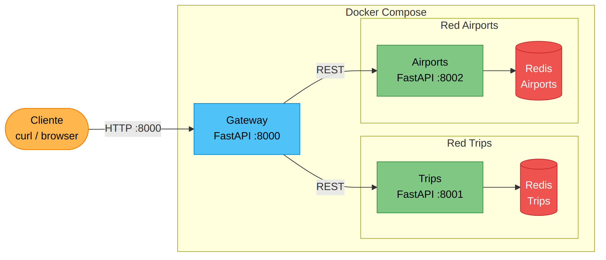

# Laboratorio: Dockerfile y Docker Compose

## Objetivo

El objetivo de este laboratorio es poner a prueba los conocimientos sobre cómo construir imágenes propias utilizando Dockerfiles y cómo orquestar múltiples contenedores utilizando Docker Compose. Para ello vamos a utilizar 3 aplicaciones implementadas en Python (FastAPI) que se comunican por REST y almacenan la información en Redis.



Se deberá:

- Definir un archivo Dockerfile para todos los servicios (`gateway`, `trips`, `airports`).
- Definir un docker-compose que permita levantar los 3 servicios mencionados junto con una instancia de Redis por cada servicio de backend (`trips`, `airports`).

A continuación se detalla una guía de cómo realizar la tarea solicitada paso a paso. La solución implementada es la mínima para cumplir con los requisitos. A lo largo del camino se dejan comentarios sobre posibles mejoras. Investiguen las preguntas que haya por su cuenta. Al final podrán encontrar las "respuestas" a las mismas.

La guía consiste en:

1. Definir el Dockerfile para gateway
2. Comenzar con el docker-compose: gateway solo
3. Definir el Dockerfile para trips
4. Incorporar trips y redis al docker compose existente

## Gateway

### Definición de la imagen base

Lo primero que necesitamos para definir el Dockerfile de una aplicación es determinar la imagen base que vamos a utilizar. Para ello tenemos 2 opciones.

- Por un lado podemos optar por utilizar una única imagen donde hagamos todo lo necesario para que la aplicación pueda correr.
- Por otro lado se puede utilizar una estrategia de [multi-stage](https://docs.docker.com/build/building/multi-stage/). Esta estrategia nos permite separar la generación de la imagen final en varias etapas. Es particularmente útil en aplicaciones compiladas, donde la cantidad de dependencias necesarias para la generación del binario puede ser alta.

Dado que la aplicación en cuestión no necesita una compilación previa y para simplificar el proceso vamos a optar por la opción 1.

```Dockerfile
FROM python:3.12

...
```

### Código fuente y dependencias

En este caso, como es una aplicación Python podemos aprovechar la imagen oficial de Python. En particular podemos utilizar `python:3.12`, la cual contiene la última versión estable de Python al momento de escribir este lab. En la página de Docker Hub de [Python](https://hub.docker.com/_/python) pueden encontrar todas las versiones y variantes disponibles. En el caso de Python existen las variantes `-alpine` y `-slim`. En este caso se eligió la "variante" principal ya que no tenemos limitaciones particulares de espacio que nos motiven a utilizar la versión `-slim`. Tampoco se utilizó la variante `-alpine` ya que, además de no necesitarse el menor espacio, esta opción puede llegar a generar problemas de dependencias.

El siguiente paso es incorporar en la imagen todo el código y dependencias que nuestra aplicación necesite para correr. Teniendo en cuenta que estamos utilizando una aplicación Python esto implica copiar todo el código fuente (archivos `.py`) e instalar las dependencias utilizando `pip`.

```Dockerfile
...

COPY . .
RUN pip install -r requirements.txt

...
```

Estas instrucciones se encargan, por un lado, de copiar todo lo que se encuentre en el mismo directorio que el Dockerfile (`.`) en el contenedor y, por el otro, de instalar las dependencias declaradas dentro del `requirements.txt`.

> ¿Dónde están siendo copiados estos archivos dentro del contenedor?
>
> Teniendo en cuenta el proceso de generación de imágenes y el cacheo de las capas, ¿cómo podríamos modificar el Dockerfile para aprovechar el cacheo de las capas? ¿Qué beneficios nos daría esto?
>
> `COPY . .` copia *todo* lo que haya en el contexto. ¿Qué hay hoy en esa carpeta que no queremos dentro de la imagen?

### Configuración final

Una vez instaladas las dependencias y agregado el código fuente, ya podemos correr la aplicación. La aplicación usa FastAPI y se ejecuta con uvicorn: `uvicorn gateway:app --host 0.0.0.0 --port 8000`.

```Dockerfile
...

CMD ["uvicorn", "gateway:app", "--host", "0.0.0.0", "--port", "8000"]
```

### Primera iteración del Dockerfile

Combinando los pasos mencionados hasta el momento tenemos el siguiente archivo como resultado:

```Dockerfile
FROM python:3.12

COPY . .

RUN pip install -r requirements.txt

CMD ["uvicorn", "gateway:app", "--host", "0.0.0.0", "--port", "8000"]
```

### Creación de Imagen y Contenedor

Para verificar el correcto funcionamiento deberemos convertir el Dockerfile en una imagen y luego generar un container a partir de la misma.

#### Build

Primero obtenemos el path de la carpeta que tiene el código de `gateway` (y donde debería estar el Dockerfile). Luego generamos la imagen utilizando `docker build -t gateway:v1 <PATH_GATEWAY>`. Lo que estamos haciendo es un build del Dockerfile que está en el directorio `<PATH_GATEWAY>` y estamos nombrando esta imagen como `gateway:v1`. En este caso `gateway` sería el nombre y `v1` la etiqueta, que identifica la primera versión de la misma.

Podrán observar que al ejecutar el build, pip nos reta por estar corriéndolo con root y nos recomienda usar un venv. Si bien una parte del dominio de este problema es el ecosistema Python (no central a la materia), el mismo se ve afectado por la forma en la que Docker opera. Por lo tanto lo analizaremos más adelante.

> A modo de ejercicio teórico: ¿Cómo podríamos hacer para que pip NO sea ejecutado por `root`?

#### Run

Una vez generada la imagen podemos generar un contenedor a partir de la misma, para ello bastaría con correr `docker run --rm gateway:v1`. En caso de que funcione podrán observar que la aplicación arranca pero si intentamos acceder a `http://localhost:8000/trip-ping` va a fallar, ya que el gateway intenta comunicarse con los servicios `trips` y `airports` que todavía no existen. Sin embargo, `http://localhost:8000/ping` debería funcionar.

Hasta ahora logramos generar un Dockerfile muy simple que nos permite correr nuestra aplicación gateway dentro de un contenedor. El siguiente paso será orquestar todos los servicios juntos usando docker-compose.

## Docker Compose: primeros servicios

### Gateway: incorporación del servicio

Vamos a comenzar con el gateway. Para ello vamos a hacer uso del Dockerfile que acabamos de definir. En un archivo llamado `docker-compose.yml` vamos a escribir

```yaml
services:
  gateway:
    build:
      context: ./gateway

...
```

> **Nota:** En versiones anteriores de Docker Compose (V1) era necesario declarar `version: "3.8"` al inicio del archivo. Con Docker Compose V2 (el que se usa actualmente con `docker compose` en vez de `docker-compose`) este campo está deprecado y ya no es necesario.

Dentro de servicios vamos a declarar el servicio llamado `gateway`. El mismo será generado a partir del Dockerfile ubicado en el contexto especificado `./gateway`. Si definimos este archivo dentro del directorio padre como `docker-compose.yaml` deberíamos tener todo lo necesario para levantar el primer contenedor de nuestro servicio. Para levantar lo que tenemos hasta ahora basta con ejecutar `docker compose up` desde el directorio padre (donde está ubicado el archivo docker-compose.yml).

### Variables de entorno

El gateway necesita saber dónde encontrar los servicios de trips y airports. Si revisamos el código de `gateway.py`, podemos ver que lee las URLs de variables de entorno (`TRIPS_URL`, `AIRPORTS_URL`). Dentro de las opciones posibles para definirlas, voy a analizar tres:

- Hardcodear los valores dentro del código.
- Definir los valores dentro del Dockerfile utilizando la sentencia `ENV`.
- Definirlas a partir del docker-compose.

Las primeras dos opciones tienen el problema de que los valores se están definiendo al momento de generar la imagen. Esto implica que las imágenes están configuradas de forma estática, dificultando su reutilización en distintos ambientes. Por otro lado la 3era opción nos permite que los valores sean definidos cuando se crea el contenedor.

Dentro de compose tenemos 2 opciones para manejar las variables de entorno: como valores literales o utilizando archivos que contengan las variables. En este caso voy a optar por el uso de archivos. Esto me permite simplificar el archivo compose y agrupar las variables en un mismo lugar. Desde la seguridad, otro beneficio importante de esta opción es desacoplar la declaración del docker compose (el cual probablemente quiera versionar) de los valores de las variables que podrían ser sensibles.

Primero vamos a definir un archivo llamado `gateway.env` en el directorio padre. Si este código es parte de un repositorio, agregaríamos este archivo al [.gitignore](https://git-scm.com/docs/gitignore)

```conf
TRIPS_URL=http://trips:8001
AIRPORTS_URL=http://airports:8002
```

y agregar un nuevo valor al servicio previamente declarado:

```yaml
services:
  gateway:
    ...
    env_file:
      - gateway.env
    ...
```

Noten que `TRIPS_URL` usa `http://trips:8001` — no usamos IPs sino el nombre del servicio (`trips`). Esto es posible gracias a que [Compose genera una red para todos los contenedores](https://docs.docker.com/compose/networking/) y crea registros DNS automáticos basados en el nombre del servicio.

### Exponiendo puertos

Lo último que queda pendiente es poder acceder a esta API desde fuera del contenedor. La aplicación levanta en el puerto `8000`. Para exponerlo en el host:

```yaml
services:
  gateway:
    ...
    ports:
      - 8000:8000
    ...
```

Podemos levantar los contenedores y verificar accediendo a `http://localhost:8000/ping`.

Con esto podemos dar por finalizada la configuración necesaria para levantar el gateway de forma exitosa.

## Trips (o Airports)

Para el siguiente paso vamos a definir el Dockerfile de uno de los servicios del back. En este caso ambos servicios son muy similares, el proceso será muy similar para ambos, por lo tanto vamos a analizar solo uno de los dos: Trips.

Teniendo en cuenta los pasos mencionados para la creación del gateway y que la aplicación también es Python/FastAPI, podemos crear un Dockerfile similar. La única consideración es ajustar el comando y el puerto. En este caso: `uvicorn trips:app --host 0.0.0.0 --port 8001`.

Para verificar su funcionamiento podemos seguir los mismos pasos realizados para el gateway o seguir adelante y verificar directamente en el compose. Por simplicidad de la guía vamos a optar por la segunda.

## Docker Compose: Incorporación de los servicios del back

La incorporación del servicio trips es muy similar a lo realizado para gateway. En este caso la aplicación no expone puertos al host ya que solo el gateway necesita ser accedido desde afuera. Respecto a la configuración de ambiente, trips necesita saber dónde está su instancia de Redis. Vamos a generar un nuevo archivo `trips.env`:

```conf
REDIS_HOST=redis-trips
REDIS_PORT=6379
```

```yaml
services:
  ...
  trips:
    build:
      context: ./trips
    env_file:
      - trips.env
  ...
```

Podemos levantar de nuevo los contenedores y verificar que esté funcionando todo. La primer buena señal sería que no haya logs de errores. Para profundizar podemos hacer un pedido a `http://localhost:8000/trip-ping`. Si están corriendo tanto el `gateway` como `trips`, el pedido debería responder exitosamente.

Para probar con airports usar `/airport-ping`.

Si queremos ver cómo todavía falta una pieza podemos hacer un `GET` a `/trip/<ID>`. Deberíamos obtener un resultado nulo. Esto se debe a que el servicio está intentando acceder a un Redis que todavía no existe.

## Docker Compose: Redis

Cada uno de los servicios (trips, airports) tendrá su propio Redis. Para el mismo utilizaremos la imagen `redis:7-alpine`. Mantendremos la configuración default.

```yaml
services:
  ...
  redis-trips:
    image: redis:7-alpine
  ...
```

Levantando todo podemos verificar que el servicio se haya conectado a Redis accediendo a `http://localhost:8000/trip/<ID>`. Si todo funciona, por más que le demos un ID inexistente, el pedido no va a fallar y devolverá `null`.

> Los contenedores están todos en una misma red, esto implica que todos ven la instancia de Redis. ¿Cómo podemos hacer para que el servicio en cuestión sea el único que pueda acceder al contenedor del Redis?

Completada la configuración de Trips faltaría replicarlo con Airports para tener toda la arquitectura funcionando.

## Uso de los servicios

### Trips

```bash
curl --header "Content-Type: application/json" \
  --request POST \
  --data '{"airport_from":"EZE","airport_to":"CPC"}' \
  http://localhost:8000/trip
```

El pedido devolverá el ID asignado al viaje. Este ID podrá ser utilizado en consultas posteriores como:

```bash
curl http://localhost:8000/trip/<TRIP_ID>
```

### Airports

```bash
curl --header "Content-Type: application/json" \
  --request POST \
  --data '{"airport": "Ezeiza"}' \
  http://localhost:8000/airport
```

El pedido devolverá el ID asignado al aeropuerto. Este ID podrá ser utilizado en consultas posteriores como:

```bash
curl http://localhost:8000/airport/<AIRPORT_ID>
```

## Mejoras

### Destino de los archivos

> ¿Dónde están siendo copiados estos archivos dentro del contenedor?

Por defecto los archivos y todos los comandos ejecutados dentro del Dockerfile son realizados desde `/`. Para modificar este comportamiento existe el comando `WORKDIR <PATH>`. Este nos permite modificar la carpeta de trabajo, lo que implica que todos los paths relativos de nuestros comandos serán relativos a PATH.

Por lo general una buena práctica es generar un directorio para poner el código fuente. Si usamos `/` sin mucho cuidado podríamos pisar partes del sistema y arriesgarnos a tener problemas.

Por lo tanto podríamos agregarle a nuestro Dockerfile lo siguiente:

```Dockerfile
FROM python:3.12

RUN mkdir -p /usr/app
WORKDIR /usr/app

...
```

Todo lo que venga después de `WORKDIR` será ejecutado dentro de `/usr/app`.

### El build context y `.dockerignore`

> `COPY . .` copia *todo* lo que haya en el contexto. ¿Qué hay hoy en esa carpeta que no queremos dentro de la imagen?

Antes de ejecutar la primera línea del Dockerfile, el cliente de Docker **empaqueta el contexto entero
en un tar y se lo manda al engine**. El contexto es el directorio que le pasamos al build (`./gateway`),
no el Dockerfile. Todo lo que esté ahí viaja, lo use el build o no.

Eso tiene dos consecuencias:

- **Tiempo**: un `__pycache__/` o un `.venv/` se transfieren en cada build.
- **Seguridad**: `COPY . .` los mete adentro de la imagen. Si hay un `.env` con credenciales, quedó
  publicado en un layer — y borrarlo en un `RUN` posterior no lo saca, porque los layers son inmutables.

La solución es un archivo `.dockerignore` en la raíz de cada contexto, con la misma sintaxis que
`.gitignore`:

```
__pycache__/
*.py[cod]
.venv/
*.env
!*.env.example
.git/
```

Cada servicio tiene el suyo (`gateway/.dockerignore`, `trips/.dockerignore`, `airports/.dockerignore`)
porque cada uno es un contexto de build distinto.

Para verificar el efecto, comparar el tamaño del contexto que reporta el build:

```bash
docker build -t gateway:v1 ./gateway 2>&1 | grep "transferring context"
```

### Versiones de las dependencias

El `requirements.txt` original declaraba las dependencias sin versión:

```
fastapi
uvicorn[standard]
redis
```

Eso significa que `pip` resuelve a la última versión disponible **en el momento del build**. Dos
compañeros del grupo que buildean con una semana de diferencia se llevan versiones distintas de FastAPI,
y el "en mi máquina anda" deja de ser una broma. Peor: rompe el sentido del cache, porque una capa
cacheada puede tener dependencias distintas a las que instalaría un build limpio.

Por eso las dependencias van pinneadas:

```
fastapi==0.141.1
uvicorn[standard]==0.52.4
redis==8.1.0
```

> Para el TP: pinnear las dependencias directas es el mínimo. Si quieren reproducibilidad completa
> (incluyendo las transitivas) hay que generar un lock — con `pip freeze`, `pip-tools` o `uv`.

### Separación en etapas

> Teniendo en cuenta el proceso de generación de imágenes y el cacheo de las capas, ¿cómo podríamos modificar el Dockerfile para aprovechar el cacheo de las capas? ¿Qué beneficios nos daría esto?

Una funcionalidad interesante de Docker y la forma en la que se manejan las imágenes es la posibilidad de reutilizar capas ya creadas, ya sea por otras imágenes o distintas versiones de la imagen que está siendo construida. El proceso de build es de arriba hacia abajo, desde el FROM hasta la última línea. Mientras no hayan cambiado las condiciones podemos reutilizar las capas. Cuando haya alguna modificación, se corta el cache y se construyen todas las capas siguientes. Una modificación puede ser causada por modificaciones en el Dockerfile o por cambios en los archivos siendo copiados a la imagen. Pueden encontrar más información en la [documentación oficial de Docker](https://docs.docker.com/build/cache/).

Volviendo a nuestro caso, una pequeña modificación que podríamos hacer sobre nuestro Dockerfile para mejorar los tiempos de build y la cantidad de espacio en imágenes sería lo siguiente.

Convertir:

```Dockerfile
COPY . .
RUN pip install -r requirements.txt
```

En:

```Dockerfile
COPY requirements.txt .
RUN pip install -r requirements.txt

COPY . .
```

Este cambio afectará solo a trips y airports, ya que son los únicos que comparten requisitos (`fastapi`, `uvicorn`, `redis`). Al momento de generar la capa asociada a `RUN pip install -r requirements.txt`, la segunda imagen podrá reutilizar la capa ya creada (`CACHED`).

### Problemas con pip

> A modo de ejercicio teórico: ¿Cómo podríamos hacer para que pip NO sea ejecutado por `root`?

Al momento de ejecutar pip tenemos el problema de que pip nos avisa que ejecutar pip como root no es recomendado, es mejor utilizar venv. Vamos a atacar este problema en dos partes. Primero vamos a incorporar el uso de venv (una funcionalidad de Python donde se genera un ambiente virtual que permite aislar la aplicación de los módulos instalados en el sistema).

Vamos a cambiar el Dockerfile a lo siguiente:

```Dockerfile
FROM python:3.12

RUN mkdir -p /usr/app \
    && python -m venv /usr/app/.venv

ENV PATH="/usr/app/.venv/bin:$PATH"
WORKDIR /usr/app

COPY requirements.txt requirements.txt

RUN pip install --upgrade pip \
    && pip install -r requirements.txt

COPY . .

CMD ["uvicorn", "gateway:app", "--host", "0.0.0.0", "--port", "8000"]
```

En este caso estamos creando un venv con `python -m venv /usr/app/.venv` y actualizando el PATH con `ENV PATH="/usr/app/.venv/bin:$PATH"`. Luego, las próximas invocaciones a pip o python utilizarán la versión definida en `/usr/app/.venv/bin`.

Si bien con estos cambios ya solucionamos los warnings de pip, todavía queda pendiente ver cómo ejecutar pip con otro usuario. En particular es de interés definir otros usuarios ya que el usuario default es root, lo cual implica riesgos de seguridad. [Do Not Run Dockerized Applications as Root](https://americanexpress.io/do-not-run-dockerized-applications-as-root/).

Para ello vamos a definir un nuevo usuario, hacerlo dueño del directorio de trabajo y sus archivos y asignarlo como usuario default para ejecutar en el contenedor.

```Dockerfile
FROM python:3.12

RUN groupadd -g 999 python \
    && useradd -r -u 999 -g python python \
    && mkdir -p /usr/app \
    && python -m venv /usr/app/.venv \
    && chown -R python:python /usr/app

ENV PATH="/usr/app/.venv/bin:$PATH"
ENV PIP_NO_CACHE_DIR=off
WORKDIR /usr/app
USER 999

COPY --chown=python:python requirements.txt requirements.txt
RUN pip install --upgrade pip && \
    pip install -r requirements.txt

COPY --chown=python:python . .

CMD ["uvicorn", "gateway:app", "--host", "0.0.0.0", "--port", "8000"]
```

Lo primero que hacemos es agregar el usuario (y grupo) que deseamos usar. Se suele definir a mano tanto el userID como el groupID (UID y GID) para que no tome valores asociados a usuarios del sistema. [Cómo se relacionan los usuarios dentro del contenedor con los del host](https://medium.com/@mccode/understanding-how-uid-and-gid-work-in-docker-containers-c37a01d01cf). Luego hacemos que el usuario sea el dueño de `/usr/app` y copiamos los archivos utilizando el nuevo usuario como propietario `COPY --chown=python:python`. Por último, declaramos el nuevo usuario como el usuario a ser utilizado por el resto de la ejecución `USER 999`.

Dado que definimos user antes de ejecutar pip, pip será ejecutado utilizando el usuario 999. Como este usuario no tiene home y pip la utiliza para guardar cache, la ejecución del mismo falla. Para eso agregamos `ENV PIP_NO_CACHE_DIR=off`.

### Últimos retoques

Por último voy a agregar algunas sentencias más al Dockerfile para darlo por terminado. Si bien no son cambios necesarios ayudan a documentar la imagen.

Los 3 cambios son:

- Incorporar labels con metadata relevante, en este caso quién es el que mantiene la imagen
- Informar qué puertos son utilizados por la aplicación (solo gateway) para facilitar el uso de la aplicación y para permitir a docker run utilizar el flag `-P`.
- Definir un healthcheck en base al funcionamiento de la imagen

```Dockerfile
FROM python:3.12

LABEL maintainer="catedra-microservicios@itba.edu.ar"

...

COPY --chown=python:python . .

EXPOSE 8000
HEALTHCHECK --interval=10s --timeout=3s --retries=3 \
    CMD python -c "import urllib.request; urllib.request.urlopen('http://localhost:8000/ping')" || exit 1

CMD ["uvicorn", "gateway:app", "--host", "0.0.0.0", "--port", "8000"]
```

> Nota: usamos `python` para el healthcheck en vez de `curl` ya que Python ya está disponible en la imagen. Esto evita instalar herramientas extra.

Podemos verificar la presencia de los labels con `docker image inspect <IMAGEN> | jq '.[].Config.Labels'`, los puertos expuestos con `docker image inspect gateway:final | jq '.[].Config.ExposedPorts'`. Por otro lado, para verificar el funcionamiento del healthcheck es necesario convertir la imagen en un contenedor. Una vez que la imagen esté corriendo, podemos utilizar `docker ps` para verificar el estado del contenedor. Podemos ver que, en la columna de status, además del uptime se muestra el estado del contenedor. Los primeros segundos va a estar en el período de `starting`, luego aplicará el healthcheck, si todo sale bien dirá `healthy`.

### Dependencia entre servicios

> ¿Cómo podemos hacer para que el gateway espere a que los servicios de backend estén listos antes de arrancar?

Lo que puede pasar es que el gateway arranque antes que trips o airports y los primeros requests fallen. Para ello Docker Compose nos permite definir dependencias entre los servicios:

```yaml
  gateway:
    ...
    depends_on:
      trips:
        condition: service_healthy
      airports:
        condition: service_healthy
```

Para que esto funcione es necesario que trips y airports tengan definido un healthcheck. Podemos agregarlo en el compose:

```yaml
  trips:
    ...
    healthcheck:
      test: ["CMD", "python", "-c", "import urllib.request; urllib.request.urlopen('http://localhost:8001/ping')"]
      interval: 5s
      timeout: 3s
      retries: 3
```

Se puede hacer lo mismo con los servicios de Redis:

```yaml
  redis-trips:
    ...
    healthcheck:
      test: ["CMD", "redis-cli", "ping"]
      interval: 5s
```

### Segregación de servicios

> Los contenedores están todos en una misma red, esto implica que todos ven la instancia de Redis. ¿Cómo podemos hacer para que el servicio en cuestión sea el único que pueda acceder al contenedor del Redis?

El último cambio que tengo para proponer es la separación de los servicios, en particular, agruparlos en distintas redes disjuntas para que solo se vean los servicios que necesitan verse entre sí.

En este caso, la principal aislación que vamos a realizar es asignar una red específica para que cada servicio se comunique con su Redis, y una red compartida para la comunicación entre gateway y los backends.

```yaml
networks:
  backend:
    driver: bridge
    internal: true
  trips:
    driver: bridge
    internal: true
  airports:
    driver: bridge
    internal: true
```

Una vez definidas las redes hay que asignarle a cada servicio las redes que queremos que use.

```yaml
services:
  gateway:
    ...
    networks:
      - backend
      - default

  trips:
    ...
    networks:
      - backend
      - trips

  airports:
    ...
    networks:
      - backend
      - airports

  redis-trips:
    ...
    networks:
      - trips

  redis-airports:
    ...
    networks:
      - airports
```

### Desarrollo local con Watch

Docker Compose incluye un modo `watch` que detecta cambios en los archivos locales y los aplica automáticamente a los contenedores en ejecución. Esto elimina el ciclo manual de "editar → rebuild → levantar de nuevo".

Para habilitarlo, se agrega una sección `develop` a cada servicio:

```yaml
services:
  gateway:
    ...
    develop:
      watch:
        - action: sync+restart
          path: ./gateway
          target: /usr/app
          ignore:
            - __pycache__/
        - action: rebuild
          path: ./gateway/requirements.txt
```

Las acciones disponibles son:

- **`sync`**: Copia el archivo al contenedor sin reiniciar. Útil para frameworks con hot-reload (ej: FastAPI con `--reload`).
- **`sync+restart`**: Copia el archivo y reinicia el contenedor. Necesario cuando el framework no detecta cambios solo.
- **`rebuild`**: Reconstruye la imagen completa. Necesario cuando cambian dependencias (`requirements.txt`).

Para levantar en modo watch:

```bash
docker compose watch
```

Probarlo: editar el return de `ping` en `gateway.py`, esperar unos segundos, y verificar con `curl http://localhost:8000/ping` que el cambio se aplicó sin intervención manual.

> **Desafío extra:** Modificar los Dockerfiles para que uvicorn arranque con `--reload` y cambiar la acción de watch a `sync` en vez de `sync+restart`. ¿Qué ventaja tiene este approach para desarrollo? ¿Por qué NO lo usaríamos en producción?
